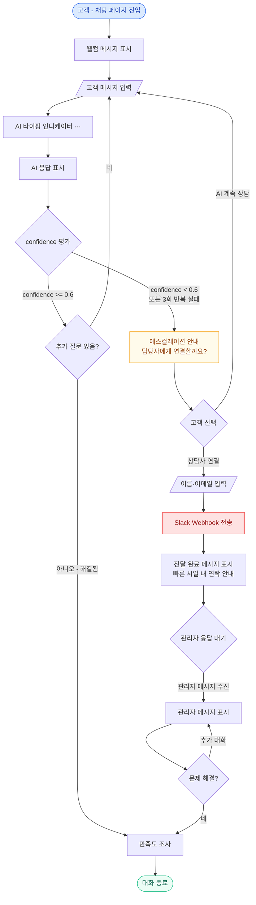
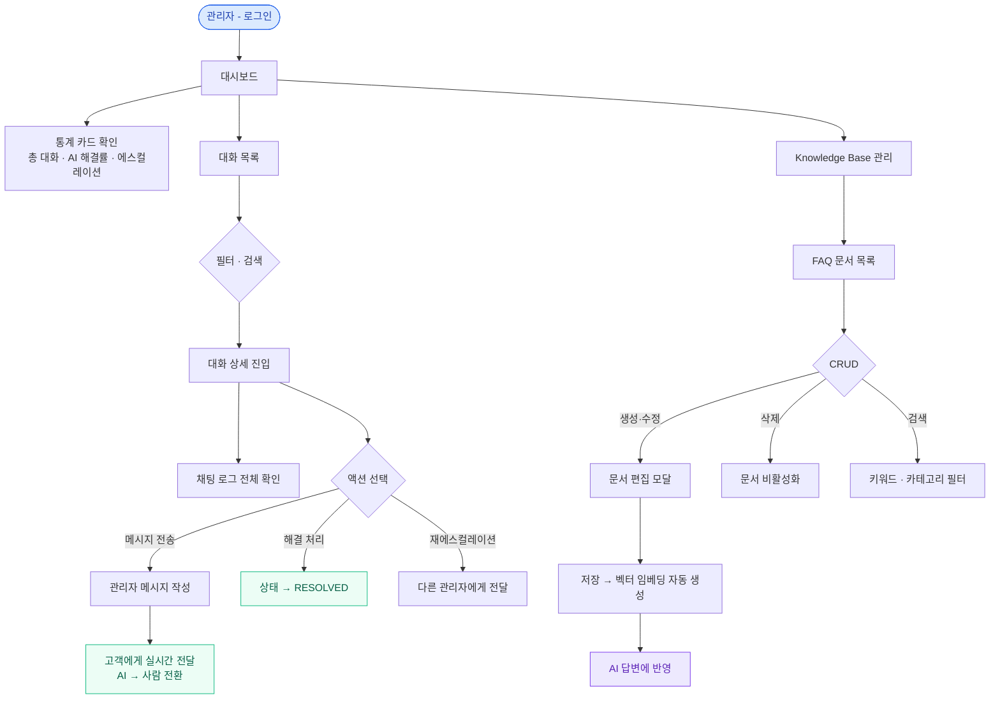
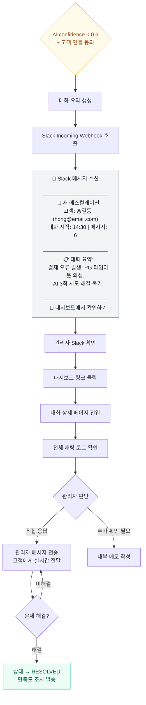
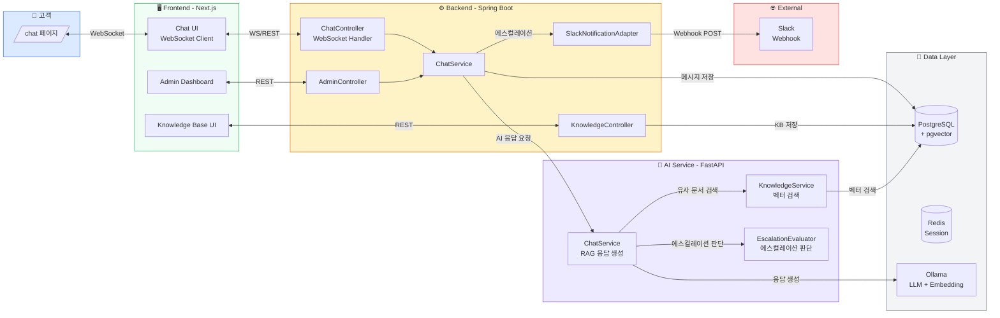
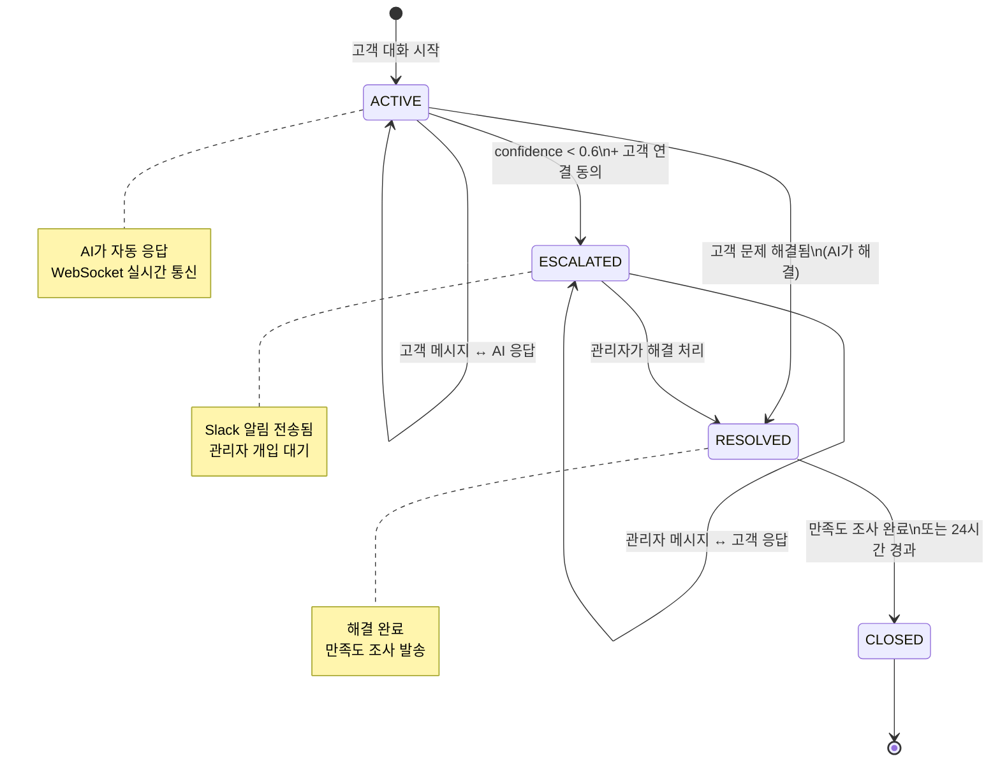
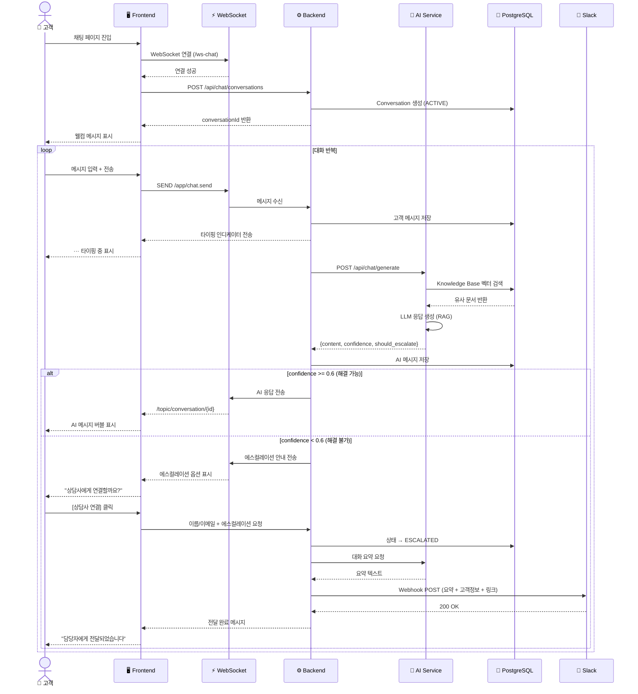

# VOC AI Chatbot — UX 상세 기획서

> 버전: 1.0 | 작성일: 2026-03-13
> AI 챗봇 기반 고객 지원 시스템 UX 상세 설계

---

## 1. 프로덕트 개요

### 1.1 핵심 가치
고객이 채팅창에 문제를 입력하면 AI가 티키타카 방식으로 대화하며 문제를 해결한다.
해결이 안 되면 대화 내용이 자동으로 Slack을 통해 관리자에게 전달된다.
모든 대화는 저장되어 관리자 대시보드에서 확인할 수 있다.

### 1.2 핵심 원칙

| 원칙 | 설명 |
|------|------|
| **즉시성** | 고객이 페이지 진입 즉시 대화 시작 가능. 회원가입/로그인 불필요 |
| **투명성** | AI임을 명확히 밝히고, 해결 불가 시 사람에게 연결됨을 안내 |
| **맥락 유지** | AI→사람 전환 시 전체 대화 이력 전달. 고객이 반복 설명하지 않음 |
| **미니멀** | 최소한의 UI로 대화에 집중. 시각적 노이즈 제거 |

---

## 2. 사용자 정의

### 2.1 고객 (Customer)
- 제품/서비스에 문제가 있어 도움이 필요한 사람
- 인증 없이 접근. 이름/이메일은 선택 입력
- 빠른 답변을 원하며, 해결이 안 되면 사람과 대화하길 원함

### 2.2 관리자 (Admin)
- 에스컬레이션된 대화를 처리하는 내부 담당자
- 대시보드에서 모든 대화를 모니터링
- Knowledge Base를 관리하여 AI 답변 품질 향상

---

## 3. 사용자 플로우

### 3.1 고객 채팅 플로우



### 3.2 관리자 플로우



### 3.3 Slack 에스컬레이션 플로우



### 3.4 시스템 전체 아키텍처 플로우



### 3.5 대화 상태 전이 다이어그램



### 3.6 메시지 처리 시퀀스



---

## 4. 화면 상세 설계

### 4.1 고객 채팅 화면 (`/chat`)

#### 레이아웃 구조

```
┌─────────────────────────────────┐
│  ┌───────────────────────────┐  │
│  │        HEADER             │  │
│  │  🤖 AI 상담 도우미        │  │
│  │  ● 온라인                 │  │
│  └───────────────────────────┘  │
│  ┌───────────────────────────┐  │
│  │                           │  │
│  │     MESSAGE AREA          │  │
│  │                           │  │
│  │  ┌─────────────┐         │  │
│  │  │ AI 메시지   │         │  │
│  │  └─────────────┘         │  │
│  │                           │  │
│  │         ┌─────────────┐  │  │
│  │         │ 고객 메시지  │  │  │
│  │         └─────────────┘  │  │
│  │                           │  │
│  │  ┌─────────────┐         │  │
│  │  │ AI 메시지   │         │  │
│  │  └─────────────┘         │  │
│  │                           │  │
│  │  ● ● ● (타이핑 중...)    │  │
│  │                           │  │
│  └───────────────────────────┘  │
│  ┌───────────────────────────┐  │
│  │  INPUT AREA               │  │
│  │  [메시지를 입력하세요...] │  │
│  │                    [전송] │  │
│  └───────────────────────────┘  │
│  ┌───────────────────────────┐  │
│  │ Powered by VOC Auto Bot   │  │
│  └───────────────────────────┘  │
└─────────────────────────────────┘
```

#### 컴포넌트 상세

**Header**
- 높이: 64px
- 좌측: AI 아바타 아이콘 (로봇 이모지 또는 커스텀 아이콘)
- 중앙: "AI 상담 도우미" 타이틀
- 하단: 상태 표시 (● 온라인 — 초록색 dot)
- 배경: white, 하단 border `#E5E7EB`

**Message Area**
- flex: 1 (남은 공간 전체 차지)
- overflow-y: auto (스크롤)
- padding: 16px
- 새 메시지 도착 시 자동 스크롤 (smooth)
- 배경: `#F9FAFB` (연한 회색)

**AI 메시지 버블**
- 정렬: 좌측
- 아바타: 좌측 상단 32x32 원형 아이콘
- 버블: `#FFFFFF` 배경, border `#E5E7EB`, border-radius 12px
- 꼬리: 좌측 상단 (말풍선 느낌)
- 텍스트: `#111827`, 14px
- 타임스탬프: `#9CA3AF`, 12px, 버블 하단 우측
- 최대 너비: 80%

**고객 메시지 버블**
- 정렬: 우측
- 아바타: 없음
- 버블: `#2563EB` (파란색) 배경, border-radius 12px
- 텍스트: `#FFFFFF`, 14px
- 타임스탬프: `#93C5FD`, 12px, 버블 하단 좌측
- 최대 너비: 80%

**관리자 메시지 버블** (에스컬레이션 후)
- 정렬: 좌측
- 아바타: 사람 아이콘 (AI 아이콘과 구분)
- 버블: `#ECFDF5` (연한 초록) 배경, border `#A7F3D0`
- 상단 라벨: "상담사" 뱃지 (초록색)
- 텍스트: `#111827`, 14px

**타이핑 인디케이터**
- AI 아바타 + 회색 버블 안에 점 3개 (bounce 애니메이션)
- 점 크기: 8px, 간격 4px
- 색상: `#9CA3AF`
- 애니메이션: 순차적 bounce (0.6s interval)

**Input Area**
- 높이: auto (min 56px, max 120px — 텍스트에 따라 확장)
- 배경: `#FFFFFF`
- 상단 border: `#E5E7EB`
- 텍스트 입력: textarea (auto-resize)
  - placeholder: "메시지를 입력하세요..."
  - font-size: 14px
  - padding: 12px 48px 12px 16px
- 전송 버튼: 우측 하단, 원형 36px
  - 비활성: `#D1D5DB` (입력 없음)
  - 활성: `#2563EB` (텍스트 있음)
  - 아이콘: 화살표 ↑ (white)
- 키보드: Enter = 전송, Shift+Enter = 줄바꿈

**Footer**
- 높이: 32px
- 텍스트: "Powered by VOC Auto Bot", `#9CA3AF`, 11px
- 중앙 정렬

#### 인터랙션 패턴

**웰컴 시퀀스** (페이지 진입 시)
```
[0.0s] 페이지 로드
[0.3s] AI 아바타 fade-in
[0.5s] 타이핑 인디케이터 표시 (1.0s간)
[1.5s] 웰컴 메시지 표시 (fade-in + slide-up)
       "안녕하세요! AI 상담 도우미입니다.
        어떤 문제가 있으신가요?"
[2.0s] 빠른 시작 버튼 표시 (선택사항)
       [결제 문제] [배송 문제] [기타 문의]
```

**메시지 전송 시퀀스**
```
[0.0s] 고객이 Enter 또는 전송 버튼 클릭
[0.0s] 고객 메시지 버블 즉시 표시 (slide-up)
[0.0s] 입력 필드 초기화 + disabled
[0.3s] AI 타이핑 인디케이터 표시
[2~5s] AI 응답 수신 (WebSocket)
[수신시] 타이핑 인디케이터 → AI 메시지 버블 전환 (fade)
[수신시] 입력 필드 enabled
[수신시] 자동 스크롤 to bottom
```

**에스컬레이션 시퀀스**
```
[조건] AI confidence < 0.6 또는 유사 질문 3회 반복
[0.0s] AI 메시지:
       "이 문제는 전문 상담사가 더 잘 도와드릴 수 있을 것 같아요."
[0.3s] 인라인 액션 버튼 2개:
       [💬 상담사 연결] [🤖 AI 계속 상담]

[상담사 연결 클릭 시]
[0.0s] 정보 입력 폼 슬라이드 표시:
       이름: [                    ]  (선택)
       이메일: [                  ]  (필수)
       [연결 요청하기]
[제출 시]
[0.0s] Slack 전송 + 시스템 메시지:
       "담당자에게 전달되었습니다.
        빠른 시일 내에 연락드리겠습니다.
        이메일로도 안내 드릴게요."
[0.5s] 대화 상태: ACTIVE → ESCALATED
```

**만족도 조사** (대화 종료 시)
```
[조건] 고객이 "감사합니다", "해결됐어요" 등 긍정 의도 감지
[0.0s] AI 메시지:
       "도움이 되셨다니 다행이에요! 😊
        혹시 상담 품질에 대해 평가해 주시겠어요?"
[0.3s] 인라인 평점:
       [😞] [😐] [😊] [😄] [🤩]
[클릭 시] "소중한 의견 감사합니다!" + 대화 종료
```

---

### 4.2 관리자 대시보드 (`/dashboard`)

#### 레이아웃 구조

```
┌──────┬──────────────────────────────────────┐
│      │  HEADER BAR                          │
│      │  VOC AI Chatbot    🔔 3    👤 Admin  │
│      ├──────────────────────────────────────┤
│ SIDE │                                      │
│ BAR  │  MAIN CONTENT                        │
│      │                                      │
│ 📊   │  ┌──────┬──────┬──────┬──────┐      │
│ Dash │  │ 총   │ AI   │ 평균  │ 에스 │      │
│ board│  │ 대화  │해결률 │응답   │컬레  │      │
│      │  │ 1,247│ 73%  │시간   │이션  │      │
│ 💬   │  │      │      │ 2.3s │ 342  │      │
│ 대화  │  └──────┴──────┴──────┴──────┘      │
│      │                                      │
│ 📚   │  ┌─────────────────┬──────────────┐  │
│ KB   │  │                 │              │  │
│      │  │  일별 추이 차트   │ 카테고리 분포 │  │
│ ⚙️   │  │  (Line Chart)   │ (Pie Chart)  │  │
│ 설정  │  │                 │              │  │
│      │  └─────────────────┴──────────────┘  │
│      │                                      │
│      │  ┌────────────────────────────────┐  │
│      │  │  최근 에스컬레이션 대화          │  │
│      │  │  ┌────────────────────────┐    │  │
│      │  │  │ 홍길동 | 결제 오류 | 5분전│    │  │
│      │  │  │ 김철수 | 배송 지연 | 12분전│   │  │
│      │  │  └────────────────────────┘    │  │
│      │  └────────────────────────────────┘  │
└──────┴──────────────────────────────────────┘
```

#### 컴포넌트 상세

**Sidebar**
- 너비: 240px (축소 시 64px — 아이콘만)
- 배경: `#111827` (다크)
- 텍스트: `#F9FAFB`
- 활성 메뉴: `#2563EB` 좌측 bar + `#1E3A5F` 배경
- 메뉴 항목:
  - 📊 Dashboard
  - 💬 대화 관리
  - 📚 Knowledge Base
  - ⚙️ 설정

**KPI 카드 (4개)**
- 그리드: 4열 (반응형 — 태블릿 2열, 모바일 1열)
- 각 카드: white 배경, rounded-lg, shadow-sm
- 내용:
  1. **총 대화** — 숫자 + 전일 대비 증감 (↑12%, 초록 / ↓5%, 빨강)
  2. **AI 해결률** — 퍼센트 + 프로그레스 바 (목표 80%)
  3. **평균 응답 시간** — 초 단위 + 전일 대비
  4. **에스컬레이션** — 건수 + 대기 중 표시 (빨간 뱃지)

**일별 추이 차트** (Line Chart)
- X축: 날짜 (최근 30일)
- Y축: 건수
- 라인 2개: 총 대화 (파란), 에스컬레이션 (빨간)
- 호버: 툴팁으로 상세 수치

**카테고리 분포** (Donut Chart)
- AI가 자동 분류한 대화 카테고리
- 예: 결제 35%, 배송 25%, 기술 20%, 기타 20%
- 가운데: 총 건수 표시

**최근 에스컬레이션 목록**
- 테이블 형태 (최근 5건)
- 컬럼: 고객명 | 주제 (AI 요약) | 경과 시간 | 상태
- 행 클릭 → 대화 상세 페이지 이동
- 상태 뱃지: 🟡 대기중 | 🟢 처리중 | ✅ 해결

---

### 4.3 대화 목록 (`/conversations`)

#### 레이아웃 구조

```
┌──────┬──────────────────────────────────────┐
│      │  대화 관리                            │
│ SIDE │  ┌──────────────────────────────────┐│
│ BAR  │  │ 🔍 검색... [상태 ▼] [기간 ▼]    ││
│      │  └──────────────────────────────────┘│
│      │                                      │
│      │  ┌──┬────────┬──────┬────┬────┬───┐ │
│      │  │  │ 고객    │ 주제  │상태│시간│AI │ │
│      │  ├──┼────────┼──────┼────┼────┼───┤ │
│      │  │  │홍길동   │결제오류│🟡 │5분 │❌ │ │
│      │  │  │hong@... │      │   │전  │   │ │
│      │  ├──┼────────┼──────┼────┼────┼───┤ │
│      │  │  │김철수   │배송문의│✅ │1시간│✅│ │
│      │  │  │kim@...  │      │   │전  │   │ │
│      │  ├──┼────────┼──────┼────┼────┼───┤ │
│      │  │  │이영희   │로그인 │🔴 │2시간│❌│ │
│      │  │  │lee@...  │불가   │   │전  │   │ │
│      │  └──┴────────┴──────┴────┴────┴───┘ │
│      │                                      │
│      │  < 1  2  3  4  5  >                  │
└──────┴──────────────────────────────────────┘
```

#### 컴포넌트 상세

**필터 바**
- 검색: 고객명, 이메일, 대화 내용 풀텍스트
- 상태 드롭다운: 전체 | 진행중 | 에스컬레이션 | 해결 | 종료
- 기간 드롭다운: 오늘 | 최근 7일 | 최근 30일 | 커스텀
- AI 해결 여부: 전체 | AI 해결 | 사람 해결

**대화 테이블**
- 컬럼:
  - 고객: 이름 + 이메일 (2줄)
  - 주제: AI가 자동 생성한 요약 (1줄, 최대 40자)
  - 상태: 컬러 뱃지
    - 🟢 `ACTIVE` (진행중) — 초록
    - 🟡 `ESCALATED` (에스컬레이션) — 노란
    - 🔵 `RESOLVED` (해결) — 파란
    - ⚫ `CLOSED` (종료) — 회색
  - 시간: 상대 시간 (5분 전, 1시간 전)
  - AI 해결: ✅ / ❌
  - 메시지 수: 숫자 뱃지
- 행 호버: 배경색 변경
- 행 클릭: 대화 상세로 이동
- 정렬: 최신순 (기본), 에스컬레이션 우선

**페이지네이션**
- 페이지당 20건
- 총 건수 표시

---

### 4.4 대화 상세 (`/conversations/[id]`)

#### 레이아웃 구조

```
┌──────┬──────────────────────────────────────┐
│      │  ← 목록으로    대화 #C-20260313-001  │
│ SIDE │  ┌────────────────┬─────────────────┐│
│ BAR  │  │                │  고객 정보       ││
│      │  │  CHAT LOG      │  이름: 홍길동    ││
│      │  │                │  이메일:         ││
│      │  │  ┌──────────┐  │  hong@email.com  ││
│      │  │  │AI: 안녕  │  │                 ││
│      │  │  │하세요!   │  │  대화 정보       ││
│      │  │  └──────────┘  │  상태: 🟡 대기중 ││
│      │  │                │  시작: 14:30     ││
│      │  │  ┌──────────┐  │  메시지: 6       ││
│      │  │  │고객: 결제 │  │  AI시도: 3회    ││
│      │  │  │가 안돼요  │  │                 ││
│      │  │  └──────────┘  │  ──────────────  ││
│      │  │                │  액션             ││
│      │  │  ┌──────────┐  │  [💬 메시지 전송] ││
│      │  │  │AI: 결제  │  │  [✅ 해결 처리]  ││
│      │  │  │수단을... │  │  [🔔 재에스컬]   ││
│      │  │  └──────────┘  │                 ││
│      │  │                │                 ││
│      │  │  ───시스템───  │                 ││
│      │  │  "에스컬레이션 │                 ││
│      │  │   되었습니다"  │                 ││
│      │  │                │                 ││
│      │  ├────────────────┤                 ││
│      │  │ [관리자 메시지  │                 ││
│      │  │  입력...]      │                 ││
│      │  │         [전송] │                 ││
│      │  └────────────────┴─────────────────┘│
└──────┴──────────────────────────────────────┘
```

#### 컴포넌트 상세

**Chat Log 영역** (좌측 — 2/3 너비)
- 고객 채팅 화면과 동일한 메시지 버블 사용
- 시스템 메시지 추가: 에스컬레이션, 상태 변경 등
  - 중앙 정렬, `#6B7280` 텍스트, 좌우 줄선 (───)
- 하단: 관리자 메시지 입력 영역
  - 입력 시 메시지가 "상담사" 라벨로 고객에게 전달됨
  - 전송 버튼: `#10B981` (초록색 — AI와 구분)

**고객 정보 패널** (우측 — 1/3 너비)
- 고객 정보 섹션:
  - 이름, 이메일, 접속 디바이스
- 대화 정보 섹션:
  - 상태 뱃지
  - 대화 시작 시간
  - 총 메시지 수
  - AI 응답 시도 횟수
  - 평균 AI confidence
- 액션 버튼:
  - `💬 메시지 전송` — 관리자 개입 시작
  - `✅ 해결 처리` — RESOLVED 상태로 변경
  - `🔔 재에스컬레이션` — 다른 관리자에게 재전달

---

### 4.5 Knowledge Base 관리 (`/knowledge`)

#### 레이아웃 구조

```
┌──────┬──────────────────────────────────────┐
│      │  Knowledge Base         [+ 새 문서]  │
│ SIDE │  ┌──────────────────────────────────┐│
│ BAR  │  │ 🔍 검색...    [카테고리 ▼]       ││
│      │  └──────────────────────────────────┘│
│      │                                      │
│      │  ┌────────────────────────────────┐  │
│      │  │ 📄 결제 실패 시 대처 방법       │  │
│      │  │ 카테고리: 결제 | 활성 ✅        │  │
│      │  │ 수정일: 2026-03-10             │  │
│      │  ├────────────────────────────────┤  │
│      │  │ 📄 배송 지연 안내 가이드        │  │
│      │  │ 카테고리: 배송 | 활성 ✅        │  │
│      │  │ 수정일: 2026-03-08             │  │
│      │  ├────────────────────────────────┤  │
│      │  │ 📄 비밀번호 재설정 절차         │  │
│      │  │ 카테고리: 계정 | 비활성 ❌      │  │
│      │  │ 수정일: 2026-03-05             │  │
│      │  └────────────────────────────────┘  │
│      │                                      │
│      │  < 1  2  3  >                        │
└──────┴──────────────────────────────────────┘
```

#### 문서 생성/수정 모달

```
┌──────────────────────────────────┐
│  📝 Knowledge Base 문서 편집      │
│  ──────────────────────────────  │
│                                  │
│  제목                            │
│  [결제 실패 시 대처 방법      ]  │
│                                  │
│  카테고리                        │
│  [결제 ▼]                        │
│                                  │
│  태그                            │
│  [결제] [오류] [PG] [+추가]      │
│                                  │
│  내용                            │
│  ┌──────────────────────────┐   │
│  │ ## 결제 실패 원인         │   │
│  │ 1. 카드 한도 초과        │   │
│  │ 2. 네트워크 오류         │   │
│  │ 3. PG사 점검 시간       │   │
│  │                          │   │
│  │ ## 해결 방법             │   │
│  │ - 다른 결제 수단 시도    │   │
│  │ - 카드사 확인            │   │
│  │ - 10분 후 재시도         │   │
│  └──────────────────────────┘   │
│                                  │
│  활성 상태: [ON 🟢]             │
│                                  │
│  [취소]              [저장하기]   │
│                                  │
│  ℹ️ 저장 시 자동으로 벡터 임베딩이│
│     생성되어 AI 답변에 반영됩니다│
└──────────────────────────────────┘
```

---

## 5. 디자인 토큰

### 5.1 컬러 팔레트

| 용도 | 토큰 | HEX | 사용처 |
|------|------|-----|--------|
| Primary | `--color-primary` | `#2563EB` | 고객 메시지 버블, CTA 버튼, 활성 메뉴 |
| Primary Light | `--color-primary-light` | `#DBEAFE` | 호버, 선택 배경 |
| Success | `--color-success` | `#10B981` | 해결 상태, 관리자 메시지, 온라인 표시 |
| Success Light | `--color-success-light` | `#ECFDF5` | 관리자 버블 배경 |
| Warning | `--color-warning` | `#F59E0B` | 에스컬레이션 상태 |
| Warning Light | `--color-warning-light` | `#FFFBEB` | 에스컬레이션 배경 |
| Danger | `--color-danger` | `#EF4444` | 에러, 긴급 표시 |
| Neutral 900 | `--color-neutral-900` | `#111827` | 사이드바 배경, 본문 텍스트 |
| Neutral 700 | `--color-neutral-700` | `#374151` | 보조 텍스트 |
| Neutral 500 | `--color-neutral-500` | `#6B7280` | 비활성 텍스트, 시스템 메시지 |
| Neutral 300 | `--color-neutral-300` | `#D1D5DB` | 보더, 디바이더 |
| Neutral 100 | `--color-neutral-100` | `#F3F4F6` | 배경 (연한) |
| Neutral 50 | `--color-neutral-50` | `#F9FAFB` | 메시지 영역 배경 |
| White | `--color-white` | `#FFFFFF` | 카드 배경, AI 버블 |

### 5.2 타이포그래피

| 용도 | 크기 | 무게 | 행간 |
|------|------|------|------|
| H1 (페이지 타이틀) | 24px | 700 (Bold) | 32px |
| H2 (섹션 타이틀) | 20px | 600 (Semi) | 28px |
| H3 (카드 타이틀) | 16px | 600 (Semi) | 24px |
| Body | 14px | 400 (Regular) | 20px |
| Body Small | 13px | 400 (Regular) | 18px |
| Caption | 12px | 400 (Regular) | 16px |
| Overline | 11px | 500 (Medium) | 16px |

- 글꼴: `Pretendard` (한글 최적화) → fallback `Inter`, `system-ui`
- 채팅 메시지: Body (14px)
- 타임스탬프: Caption (12px)
- KPI 숫자: 32px Bold

### 5.3 간격 시스템

| 토큰 | 값 | 사용처 |
|------|-----|--------|
| `--space-xs` | 4px | 인라인 간격 |
| `--space-sm` | 8px | 요소 내부 padding |
| `--space-md` | 12px | 버블 내부 padding |
| `--space-base` | 16px | 카드 padding, 섹션 간격 |
| `--space-lg` | 24px | 그리드 gap |
| `--space-xl` | 32px | 섹션 간 margin |
| `--space-2xl` | 48px | 페이지 padding |

### 5.4 그림자

| 레벨 | 값 | 사용처 |
|------|-----|--------|
| Shadow SM | `0 1px 2px rgba(0,0,0,0.05)` | 카드, 버튼 |
| Shadow MD | `0 4px 6px rgba(0,0,0,0.07)` | 모달, 드롭다운 |
| Shadow LG | `0 10px 15px rgba(0,0,0,0.1)` | 채팅 윈도우 (위젯 모드) |

### 5.5 Border Radius

| 토큰 | 값 | 사용처 |
|------|-----|--------|
| `--radius-sm` | 6px | 버튼, 입력 필드 |
| `--radius-md` | 8px | 카드, 패널 |
| `--radius-lg` | 12px | 메시지 버블 |
| `--radius-xl` | 16px | 채팅 윈도우 |
| `--radius-full` | 9999px | 아바타, 뱃지 |

---

## 6. 반응형 브레이크포인트

| 이름 | 너비 | 레이아웃 변경 |
|------|------|--------------|
| Mobile | < 640px | 채팅: 전체 화면, 사이드바 없음 |
| Tablet | 640–1024px | 대시보드: 2열 그리드, 사이드바 축소 |
| Desktop | > 1024px | 전체 레이아웃 표시 |

**채팅 페이지 반응형:**
- Desktop: 중앙 정렬, max-width 480px (모바일 느낌)
- Mobile: 전체 화면 (100vw, 100vh)

**대시보드 반응형:**
- Desktop: 사이드바 240px + 메인 영역
- Tablet: 사이드바 64px (아이콘) + 메인 영역
- Mobile: 하단 탭 네비게이션 + 메인 영역

---

## 7. 접근성 (A11y)

| 항목 | 기준 |
|------|------|
| 색상 대비 | WCAG AA 이상 (4.5:1 텍스트, 3:1 대형 텍스트) |
| 키보드 네비게이션 | Tab/Shift+Tab으로 모든 인터랙티브 요소 접근 가능 |
| 스크린 리더 | 메시지에 role="log", 새 메시지 aria-live="polite" |
| 포커스 표시 | 모든 버튼/입력에 visible focus ring (2px, `#2563EB`) |
| 입력 레이블 | 모든 입력에 aria-label 또는 visible label |

---

## 8. 애니메이션 & 트랜지션

| 요소 | 애니메이션 | 시간 | Easing |
|------|-----------|------|--------|
| 메시지 등장 | slide-up + fade-in | 200ms | ease-out |
| 타이핑 인디케이터 | dot bounce | 600ms (각 dot 200ms delay) | ease-in-out |
| 버튼 호버 | background-color | 150ms | ease |
| 모달 열기 | fade + scale(0.95→1) | 200ms | ease-out |
| 모달 닫기 | fade + scale(1→0.95) | 150ms | ease-in |
| 사이드바 토글 | width change | 200ms | ease |
| 토스트 알림 | slide-right + fade | 300ms | ease-out |
| 페이지 전환 | fade | 150ms | ease |

---

## 9. 에러 & 엣지 케이스

### 9.1 네트워크 오류
```
[WebSocket 연결 끊김]
→ 상단 배너: "연결이 끊어졌습니다. 재연결 중..." (노란색 배경)
→ 3초 간격 자동 재연결 시도 (최대 5회)
→ 실패 시: "네트워크를 확인해 주세요. [다시 시도]"
→ 재연결 성공 시: 미수신 메시지 자동 동기화
```

### 9.2 AI 응답 지연
```
[5초 이상 응답 없음]
→ 타이핑 인디케이터 유지
→ 10초 후: "잠시만 기다려 주세요, 답변을 준비하고 있어요..."
→ 30초 후: "응답 시간이 길어지고 있어요. 상담사에게 연결할까요?"
     [상담사 연결] [조금 더 기다리기]
→ 60초 (타임아웃): 자동 에스컬레이션 제안
```

### 9.3 빈 대화
```
[관리자가 대화 상세 진입했으나 메시지 없음]
→ 빈 상태 일러스트 + "아직 대화 내용이 없습니다."
```

### 9.4 동시 관리자 접근
```
[같은 대화에 2명 이상 관리자 접근]
→ 상단 알림: "김관리자님이 이 대화를 보고 있습니다."
→ 메시지 전송 시 충돌 방지: 최신 메시지 기준 자동 정렬
```

---

## 10. 화면 목록 정리

| # | 경로 | 화면명 | 인증 | 설명 |
|---|------|--------|------|------|
| 1 | `/chat` | 고객 채팅 | ❌ | Stripe 스타일 AI 채팅 인터페이스 |
| 2 | `/login` | 관리자 로그인 | ❌ | ID/PW 로그인 폼 |
| 3 | `/dashboard` | 대시보드 | ✅ | KPI 카드 + 차트 + 최근 에스컬레이션 |
| 4 | `/conversations` | 대화 목록 | ✅ | 필터/검색/페이지네이션 테이블 |
| 5 | `/conversations/[id]` | 대화 상세 | ✅ | 채팅 로그 + 고객 정보 + 관리자 개입 |
| 6 | `/knowledge` | KB 관리 | ✅ | FAQ/문서 CRUD + 벡터 임베딩 연동 |

총 **6개 화면**으로 구성됩니다.
